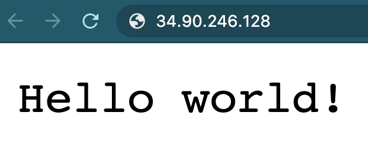

# How to Develop Applications on Kubernetes with Okteto

Kubernetes can negatively impact a developer's productivity, especially when you need to test and debug your applications. Suddenly, the traditional inner loop increases; now you must, at a minimum: pack your application into a container, push it to a container registry, and then tell Kubernetes to pull that image. All of this can take a considerable amount of time.

The [Okteto CLI](https://github.com/okteto/okteto) is an open-source project that provides local development experience for applications running on Kubernetes. You write your code on your local IDE and as soon as you save a file, the change goes to the Kubernetes cluster and your app instantly updates. This whole process happens in an instant without the need to build docker images or apply Kubernetes manifests. 

In this tutorial, you’ll learn how to improve your productivity when developing Kubernetes-native apps. First, you'll create a Kubernetes cluster in DigitalOcean and use it to run a simple "Hello World" application. Then you’ll use Okteto to develop and automatically update your application without having to install anything locally. Developing on Kubernetes provides a replicable environment that’s as close to production as possible. Additionally, with Okteto, your inner development loop improves, and hence your productivity too.

<!--NOTE:
This introduction does a great job of telling the reader what they will accomplish and why this lesson is a valuable one. I've suggested a few little rephrasings here and there, just to tighten things up. What do you think? And I'd love it if you could help describe Okteto a little more fully:

Kubernetes can negatively impact a developer's productivity, especially when you need to test and debug your applications. Suddenly, the traditional inner loop increases; now you must, at a minimum: pack your application into a container, push it to a container registry, and then tell Kubernetes to pull that image. All of this can take a considerable amount of time.

1-2 sentences Okteto. Can you explain to the reader what Okteto is and why it is important? Maybe like:
Okteto solves many development-productivity issues around Kubernetes...

In this tutorial, you’ll learn how to improve your productivity when developing Kubernetes-native apps. First, you'll create a Kubernetes cluster in DigitalOcean and use it to run a "Hello World" application (is this app maintained by Okteto?). Then you’ll use Okteto to develop and automatically update your application without having to install anything locally. Kubernetes development platforms like Okteto provide a replicable environment that’s as close to production as possible. Additionally, with Okteto, your inner development loop improves, and hence your productivity too. -->

<!-- Pablo: The hello world application is a very simple app we use in our demos: it's a single service,
with a single endpoint that returns 'Hello World' on a GET request   -->

## Pre-Requisites

Before you begin this tutorial, you'll need the following:
<!--NOTE: could we change this slightly to offer people an option? Something like this?:
* A Kubernetes 1.12+ cluster. In this tutorial, the setup will use a [DigitalOcean Kubernetes](https://www.digitalocean.com/docs/kubernetes/how-to/create-clusters/) cluster with three nodes, but you are free to create a [cluster using another method](https://www.digitalocean.com/community/tutorials/how-to-create-a-kubernetes-cluster-using-kubeadm-on-ubuntu-18-04).
-->
* A Kubernetes 1.12+ cluster. In this tutorial, the setup will use a [DigitalOcean Kubernetes](https://www.digitalocean.com/docs/kubernetes/how-to/create-clusters/) cluster with three nodes, but you are free to create a [cluster using another method](https://www.digitalocean.com/community/tutorials/how-to-create-a-kubernetes-cluster-using-kubeadm-on-ubuntu-18-04).
* `kubectl` and `doctl` [installed and configured](https://www.digitalocean.com/docs/kubernetes/how-to/connect-to-cluster/) to communicate with your cluster.
* A [Docker Hub account](https://hub.docker.com/)
* [Docker](https://www.docker.com/products/docker-desktop) running in your local machine.

## Step 1 — Creating the Hello World Application
<!--NOTE: can we add to this intro? Perhaps something like?:
The "Hello World" program is a time-honored tradition in web development. Now that you've created your Kubernetes cluster, let's create a "Hello World" app in Golang and the manifests that you'll use to deploy it on Kubernetes.

Create a ...
-->

The "Hello World" program is a time-honored tradition in web development. It is a simple service that responds "Hello World" to every request. Now that you've created your Kubernetes cluster, let's create a "Hello World" app in Golang and the manifests that you'll use to deploy it on Kubernetes.

First change to your home directory:

```command
cd ~
```

Now make a new directory called `hello_world` and move inside it:

<!--NOTE: for commands, please use ```command-->
<!--NOTE: please split the commands and introduce each one. no need to explain these, however. Like this:

First change to your home directory:

```command
cd ~
```

Now make a new directory called `hello_world` and move inside it:

```command
mkdir
cd
```
-->


```command
mkdir hello_world
cd hello_world
```

Open a new file under the name `main.go` with your favorite IDE or text editor:

```console
nano main.go
```

`main.go` will be a Golang web server that returns the message *Hello world!*. So, let's use the following code:

```golang
[label main.go]
package main

import (
    "fmt"
    "net/http"
)

func main() {
    fmt.Println("Starting hello-world server...")
    http.HandleFunc("/", helloServer)
    if err := http.ListenAndServe(":8080", nil); err != nil {
        panic(err)
    }
}

func helloServer(w http.ResponseWriter, r *http.Request) {
    fmt.Fprint(w, "Hello world!")
}
```

<!--NOTE: This is a great place for an explanation. Many readers will benefit from a careful breakdown of code blocks like this, from an expert like yourself. Can you briefly explain what the package, import, and two func code lines are doing/configuring? --> 

The code in `main.go` does the following:
* The first statement in a Go source file must be `package` name. Executable commands must always use package main.
* The `import` section indicates which packages the code depends on. In this case it uses `fmt` for string manipulation, and `net/http` for the http server.
* The `main` function is the entry point to our binary. The `http.HandleFunc` method is used to configure the server to call the `helloServer` function when a request to the `/` path is received. `http.ListenAndServe` starts an http server that listens on all network interfaces on port `8080`.
* The `helloServer` function contains the logic of our request handler. In this case, it will write `Hello world!` as the response to the request.

<!--NOTE: if the reader requires a Dockerhub account than we must list that as a pre-requisite-->
You need to create a Docker image and push it to the Docker registry so that Kubernetes can pull it, and run the application.

Open a new file under the name `Dockerfile` with your favorite IDE or text editor:

```command
nano Dockerfile
```

The `Dockerfile` will contain the commands required to build our application's Docker container. Let's use
the following code:

<!--if we need to create this dockerfile, then let's add those commands too-->
```yaml
[label Dockerfile]
FROM golang:alpine as builder
RUN apk --update --no-cache add bash
WORKDIR /app
ADD . .
RUN go build -o app

FROM alpine as prod
WORKDIR /app
COPY --from=builder /app/app /app/app
EXPOSE 8080
CMD ["./app"]
```

<!--NOTE: can you break this down into more detail for the reader? thanks :)-->
The `Dockerfile` is broken into two stages, `builder` and `prod`:
* The `builder` stage contains the go build tools. It's responsible for copying the files and building the go binary. 
* The `prod` stage is the final image. It will contain only a stripped down OS and the application binary. 

This is a good practice to follow. It makes our production containers smaller and safer since they only contain our application and exactly what is needed to run it.

Build the container image (replace `{{USERNAME}}` with your Docker Hub username):

```command
docker build -t {{USERNAME}}/hello-world:latest .
```

And push it into Docker Hub:

```command
docker push {{USERNAME}}/hello-world:latest
```

<!--NOTE: can you explain what these Docker commands are doing briefly? Maybe just one sentence here? -->


Next, create a new folder for the Kubernetes manifests:

```command
mkdir k8s
```

When you use a Kubernetes manifest, you tell Kubernetes how you want your application to run. This time, you'll create a [deployment](https://kubernetes.io/docs/concepts/workloads/controllers/deployment/) object. So, create a new file `deployment.yaml` with your favorite IDE or text editor:

```command
nano k8s/deployment.yaml
```

The following content describes a Kubernetes deployment object that runs the `okteto/hello-world:latest` Docker image. In your case, use the name you used when building the Docker image previously (`{{USERNAME}}/hello-world:latest`):

```yaml
[label k8s/deployment.yaml]
apiVersion: apps/v1
kind: Deployment
metadata:
  name: hello-world
spec:
  selector:
    matchLabels:
      app: hello-world
  replicas: 1
  template:
    metadata:
      labels:
        app: hello-world
    spec:
      containers:
      - name: hello-world
        image: <^>okteto<^>/hello-world:latest
        ports:
        - containerPort: 8080
```
<!--NOTE: I added some code highlighting here-->
<!--NOTE: Can you provide some more detail on this code block?-->

The deployment manifest has three main sections:
- The `metadata` tells Kubernetes the name you want for the deployment.
- The `replicas` tells Kubernetes how many copies of it you want running.
- The `template` tells Kubernetes what to deploy, and what labels to add. In this case, a single container, with the `okteto/hello-world:latest` image, listening on port `8080`, and with the `app: hello-world` label. Note that this label is the same used in the `selector` section.

You'll now need a way to access your application. You can expose an application on Kubernetes by creating a [service](https://kubernetes.io/docs/concepts/services-networking/service/) object. Let's continue using manifests. Create a new file `service.yaml` with your favorite IDE or text editor:

```console
nano k8s/service.yaml
```

The following content describes a service that exposes the `hello-world` deployment object, which under the hood will use a DigitalOcean load balancer:

```yaml
[label k8s/service.yaml]
apiVersion: v1
kind: Service
metadata:
  name: hello-world
spec:
  type: LoadBalancer
  ports:
    - protocol: TCP
      port: 80
      targetPort: 8080
      name: http
  selector:
    app: hello-world
```
<!--NOTE: can you addd any detail here? what are these configurations doing and why are they important?-->
The service manifest has four main sections:
* The `metadata` tells Kubernetes the name you want for the service.
* The `type` tells Kubernetes how you want to expose your service. In this case, it will expose it externally through a Digital Ocean load balancer.
* The `ports` tell which ports you want to expose, and how to map them to your deployment. In this case, it will expose port 80 externally and direct it to port 8080 in your deployment.
* The `selector` tells Kubernetes which set of pods to send the traffic to. In this case, any pod with the `app: hello-world` label will receive traffic.

Now you have everything ready to deploy the "Hello World" application on Kubernetes. We will do this next.

## Step 2 — Deploying your Hello World Application

In this step you'll deploy your "Hello World" application on Kubernetes. Then you'll validate that it is working correctly.

Start by deploying your application on Kubernetes:
<!--this is a command + output. Also my output says created not deleted. should it be this?:
```command
$ kubectl apply -f k8s
```

You'll see the following output:

```
[secondary_label Output]
deployment.apps "hello-world" deleted
service "hello-world" deleted
```
-->
<!-- Pablo: the command output should say created -->

```command
$ kubectl apply -f k8s
```

```
[secondary_label Output]
deployment.apps "hello-world" created
service "hello-world" created
```

After about one minute, you will be able to get the IP of your application from the `EXTERNAL-IP` column when it lists your Kubernetes service objects:

```console
$ kubectl get service hello-world
NAME          TYPE        CLUSTER-IP   EXTERNAL-IP      PORT(S)    AGE
hello-world   ClusterIP   <^>your_cluster_ip<^>   <^>your_external_ip<^>  8080/TCP   37s
```

Open your browser and go to `<^>your_external_ip<^>` listed for your "Hello World" application. Confirm that your application is up and running before continuing with the next step:

<!--NOTE: Can we add a screenshot here? What should the reader see? I can pull one from my side too... -->



Until this moment, you've followed a fairly traditional pathway for developing applications with Kubernetes. Moving forward, when you want to change the code in your application, you'll have to build and push the new Docker image, and then pull that image from Kubernetes. This process can take five minutes, or even longer. So, let's use Okteto to improve our development inner-loop when working with Kubernetes.

## Step 3 — Installing Okteto CLI

You will now improve your Kubernetes development productivity by installing the Okteto CLI. The [Okteto CLI](https://github.com/okteto/okteto) is an open-source project that lets you synchronize application code changes to an application running on Kubernetes. You can continue using your favorite IDE, debuggers, or compilers without having to commit, build, push, or redeploy containers to test your application–as you did in the previous steps. 

To install the Okteto CLI on a macOS or Linux machine, run the following command:

```command
curl https://get.okteto.com -sSfL | sh
```

<!--lets break this command down here. Maybe something like:
"Lets take a closer look at this command:
* The `curl` command [does this].
* The `-s` flag [does this].
* The `-S` flag [does this].
* The `-f` flag [does this].
* The `-L` flag [does this].
* The `|` operator pipes this output to the `sh` command, which [...]. -->

Lets take a closer look at this command:
* The `curl` command is used to transfer data to and from a server.
* The `-s` flag suppresses any output.
* The `-S` flag shows errors.
* The `-f` flag causes the request to fail on HTTP errors.
* The `-L` flag makes the request follow redirects.
* The `|` operator pipes this output to the `sh` command, which will download and install the latest `okteto` binary in your local machine.

If you are running Windows, you can alternately [download the file through your web browser](https://downloads.okteto.com/cli/okteto.exe) and manually add it to your `$PATH`.

Once the Okteto CLI is installed, you are ready to put the "Hello World" application in development mode.

## Step 4 — Putting the Hello World Application in Development Mode

Now, the Okteto CLI will swap the application running on a Kubernetes cluster with the code you have in your machine. To do so, Okteto uses the information provided from an [Okteto manifest](https://okteto.com/docs/reference/manifest/index.html) file. This file declares the Kubernetes deployment object that will swap with your local code.

Create a new file called `okteto.yaml` with your favorite IDE or text editor.

```console
nano okteto.yaml
```

Let's use a simple manifest where you define the deployment object name, the Docker base image to use, and a shell. We will return to this information later. Use the following sample content file:
<!--NOTE: please add filepath below-->
```yaml
[label okteto.yaml]
name: hello-world
image: okteto/golang:1
workdir: /app
command: ["bash"]
```

Prepare to put your application in development mode by running the following command:

```command
okteto up
```

```custom_prefix(okteto>)
[secondary_label Output]
 ✓  Development environment activated
 ✓  Files synchronized
    Namespace: default
    Name:      hello-world

Welcome to your development environment. Happy coding!
default:hello-world /app>
```

The `okteto up` command swaps the "Hello World" application into a development environment, which means:
<!--This is such a fantastic breakdown! Use this as a model for your other expansions.-->
* The Hello World application container is updated with the docker image `okteto/golang:1`. This image contains the required dev tools to build, test, debug, and run the "Hello World" application.

* A [file synchronization service](https://okteto.com/docs/reference/file-synchronization/index.html) is created to keep your changes up-to-date between your local filesystem and your application pods.

* A remote shell starts in your development environment. Now you can build, test, and run your application as if you were in your local machine.

* Whatever process you run in the remote shell will get the same incoming traffic, the same environment variables, volumes, or secrets as the original "Hello World" application pods. This, in turn, gives you a highly-realistic, production-like development environment.

In the same console, now run the application as you would typically do (without building and pushing a Docker image), like this:
<!--NOTE: I have added our custom-prefix formatting here-->
```custom_prefix(okteto>)
okteto> go run main.go
```

```
[secondary_label Output]
Starting hello-world server...
```

The first time you run the application, Go will download your dependencies and compile your application. Wait for this process to finish and test your application by opening your browser and refreshing the page of your application, just as you did previously.
<!--NOTE: Perhaps in addition?:
...Once the refresh is successful, you are ready to begin developing directly on Kubernetes.-->

Now you are ready to begin developing directly on Kubernetes.

## Step 5 — Developing Directly on Kubernetes

Let's start making changes to the "Hello World" application and then see how these changes get reflected in Kubernetes.
<!--Can we please explicitly signpost every shift from the okteto environment to the local command line? are we exiting that and returning to terminal and the oketeto up-ing again? Or are we editing in a new terminal window?-->
<!-- Pablo: the reader should be switching between two consoles, one with okteto up running and a separate one -->

Open the `main.go` file with your favorite IDE or text editor. For example, on a separate console, run the following command:

```command
[environment second]
nano main.go
```

Then, change your response message to `Hello world from DigitalOcean!`:

```golang
[label main.go]
package main

import (
    "fmt"
    "net/http"
)

func main() {
    fmt.Println("Starting hello-world server...")
    http.HandleFunc("/", helloServer)
    if err := http.ListenAndServe(":8080", nil); err != nil {
        panic(err)
    }
}

func helloServer(w http.ResponseWriter, r *http.Request) {
    fmt.Fprint(w, "Hello world from DigitalOcean!")
}
```

It is here that your workflow changes. Instead of building images and redeploying containers to update the "Hello World" application, Okteto will synchronize your changes to your development environment on Kubernetes.
<!--is this in the right place? please double check that the reader has the proper commands so that they are in the right environment here-->
<!-- Pablo: the ctrl+c should happen on the same console than okteto up -->

From the console where you executed the `okteto up` command, cancel the execution of `go run main.go` by pressing `CTRL + C`. Now rerun the application:

```custom_prefix(okteto>)
default:hello-world /app> go run main.go
```

```
Starting hello-world server...
```

Go back to the browser and reload the page for your "Hello World" application.

Your code changes were applied instantly to Kubernetes. No commits, builds, or pushes required!

## Conclusions

[Okteto](https://www.okteto.com) transforms your Kubernetes cluster into a fully-featured development platform with the click of a button. In this tutorial you installed and configured the [Okteto CLI](https://github.com/okteto/okteto) to iterate your code changes directly on Kubernetes as fast as you can type code. Now you can head over to the [Okteto samples repository](https://github.com/okteto/samples) to see how to use Okteto with different programming languages and debuggers.

Also, if you share a Kubernetes cluster with your team, we recommend that you give each member access to a secure Kubernetes namespace, configured to be isolated from other developers working on the same cluster. This great functionality is provided by the [Okteto App](https://marketplace.digitalocean.com/apps/okteto-1) in the [DigitalOcean Kubernetes marketplace](https://marketplace.digitalocean.com/category/kubernetes).
